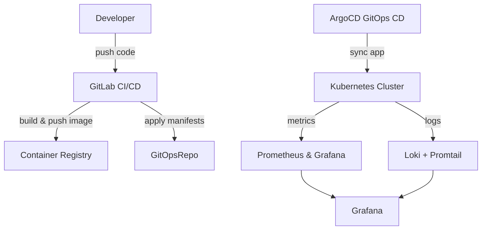

---

## 📌 System Architecture



---

## 📦 Project Structure

```
project-root/
├── .gitlab-ci.yml
├── Dockerfile
├── app/
├── manifests/
├── argocd/
└── README.md
```

---

## 🚀 Deployment Instructions

### 1. Prerequisites
- kubeadm-based Kubernetes cluster
- NGINX Ingress Controller
- cert-manager
- ArgoCD installed
- GitLab CI + Container Registry
- Prometheus-Grafana-Loki setup

### 2. Run GitLab CI/CD
Includes:
- black (lint)
- pytest (test)
- trivy (scan)
- docker build + push
- deploy to Kubernetes via kubectl

### 3. Deploy FastAPI via ArgoCD
```bash
kubectl apply -f argocd/application-dev.yaml
kubectl apply -f argocd/application-prod.yaml
```

---

## 📊 Monitoring & Scaling Strategy

### Monitoring:
- Prometheus: metrics
- Grafana: dashboards
- Loki: logs
- metrics-server: HPA metrics

### Scaling:
- HorizontalPodAutoscaler (HPA)
- Cluster Autoscaler (optional for kubeadm)

---

## 🔐 Config & Secret Management

### ConfigMap:
Non-sensitive values:
```yaml
data:
  TIMEZONE_OFFSET: "+5.5"
  GREETING: "Hello from Kubernetes!"
```

### Secret:
Sensitive values:
```yaml
stringData:
  DUMMY_API_KEY: dummyapikey123
  SECRET_MESSAGE: supersecretmessage
```

Use Sealed Secrets or external secrets manager for production.

---

## 🛡️ Security Best Practices

- Trivy for image scanning
- RBAC with service accounts
- TLS via cert-manager (Let's Encrypt)
- Secrets in K8s, never hardcoded
- Resource limits, HPA, ingress whitelisting

---

## 📎 Quick Commands

```bash
# Get Grafana password
kubectl get secret -n monitoring kube-prometheus-stack-grafana -o jsonpath="{.data.admin-password}" | base64 -d

# Port forward Grafana
kubectl port-forward -n monitoring svc/kube-prometheus-stack-grafana 3000:80

# View metrics
kubectl top pods
```

---

## 🤝 Contributors
- [@kashish6707](https://gitlab.com/kashish6707-group)
